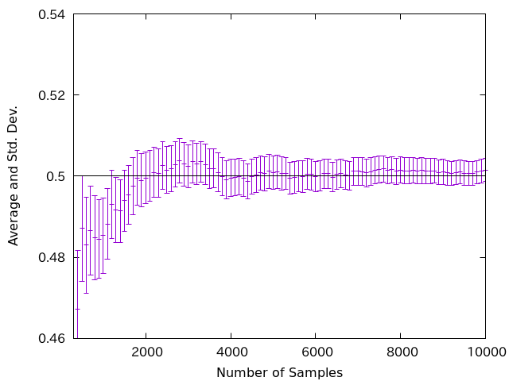
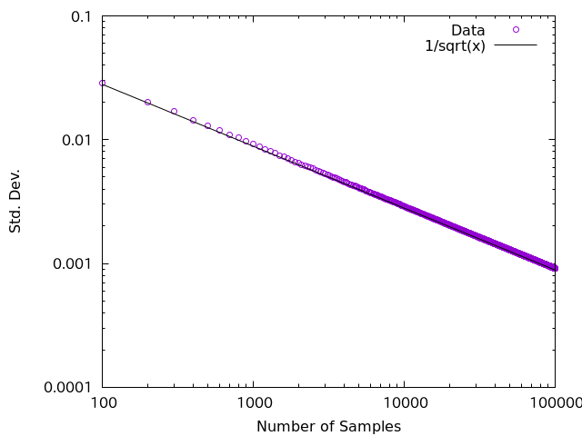

# Test code

## Usage

```sh
make graph
```

## Expected results

This code investigates the properties of the uniform random variable (0,1).

The average converges to 0.5.



The standard deviation reduces as 1/sqrt(N) where N is the number of samples.


